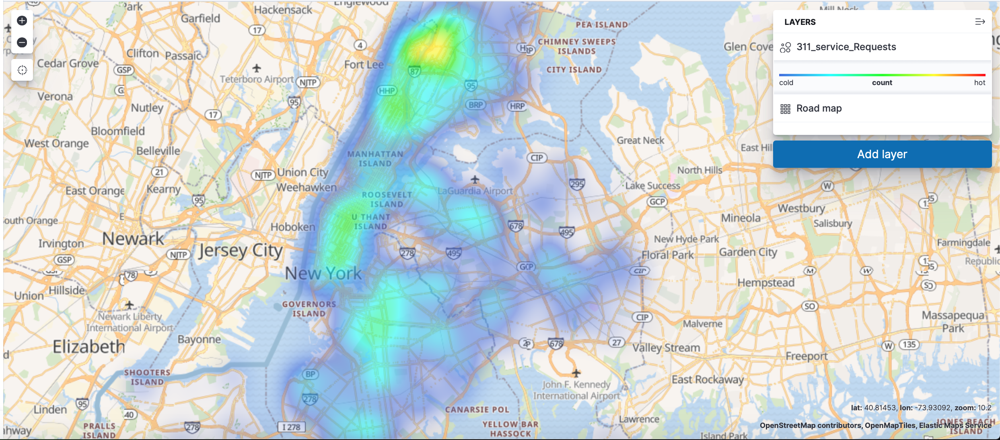

# NIFI + ELK Exercise
Ingest data from API into ELK using nifi for visualization with Kibana.

### **Attachments**
1. Docker-compose for launching: Nifi + Elasticsearch + Kibana

2. Nifi template

3. Kibana screenshot

